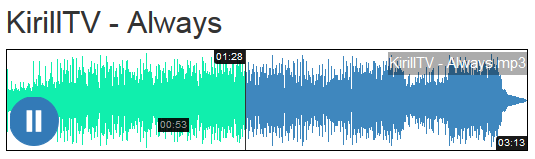

# JUSTWAVE

Creates `PNG waveforms` of audio (mp3/ogg) and use them in Web applications.



## Welcome to JustWave Project

Create PNG waveform of audio (mp3/ogg) and use it in Web applications

`JustWave` tries to make it easy to create and use waveforms of different audios for your Web applications. It can create waveform for any audio (or even video) that `ffmpeg` can accept but aimed primarily to mp3 and ogg audio for they are most suitable for browsers. To use it you should create an instance of `JustWave class` and call method create with path or url to an audio as a single parameter. All additional parameters passed through constructor method as a link to external array (**POST/GET/ARGV** etc. - see below).

`JustWave Project` consists of several server- and client-side scripts and aimed to create waveforms of audio - ogg/mp3, any - for interactive players as an example.

The main script is server-side script `JustWave.class.php`. It uses `ffmpeg` system binary as a back-end for converting audio to `WAV` (PCM) format in order to create peaks of waveform.

There are two server-side scripts based on it - **justwave.ajax.php** and **justwave.cli.php**.

**justwave.player.js** has been made to create and control waveforms of audio elements for HTML pages and uses `justwave.ajax.php` server-side script as a back-end for creating PNG-waveforms.

## JustWave.class.php

Parameters source can be passed in construction method and is a super-global `$_POST` array by default. You can use `POST`, `GET`, `REQUEST`, `COOKIE`, `SESSION` or `ARGV` constants. When `ARGV` constant used you should pass an array with *'option=value'* string values as a second parameter (see **justwave.cli.php** description below).

All possible parameters are described for `justwave.ajax.php` script.

Usage of this class (PHP native code):

```php
require_once 'JustWave.class.php';

// we accept parameters as GET data
// e.g.: script.php?mode=file&wave_color=F00&prog_color=F00&back_color=0F0
$justwave = new JustWave('GET');
// create waveform image(s)
$justwave->create('my_song.mp3');
if($justwave->status == 'ok') {
  echo 'Duration of my_song.mp3 = ' . $justwave->duration . '<br>';
  echo 'See waveform image under the link: <a href="' . $justwave->dataUrlWave . '">waveform</a>';
}
else
  echo 'Failed! Message = ' . $justwave->message;
```

After calling create method following public properties will be initialized:

* **status** - Status, string: ok or err.
* **message** - String message describing status result more thoroughly.
* **duration** - Duration of audio in seconds (fixed value).
* **url** - Url or path to the audio (such as input parameter).
* **key** - MD5 key of audio url, waveform dimensions and colors.
* **audio** - Base name of the audio.
* **dataUrlWave** - Image src or data-url of main wave.
* **dataUrlProgress** - Image src or data-url of progress wave.

In `file mode` there are two PNG waveform images that will be generated in the wavedir directory on the server, **$this->md5.png** and **$this->md5_bg.png**. If `wave_color = prog_color` the image will be only one (**$this->md5.png**).

**$this->dataUrlWave** and **$this->dataUrlProgress** will hold relative links to these waveform `PNG` images.

In `dataurl mode` these two properties will hold data-url of PNG images in themselves. If wave_color = prog_color $this->dataUrlProgress will be null.

If you get permanent error **Conversion failed** it seems that your server (on which you host your site) does not have `ffmpeg` binary installed.

You can install it through your distro package manager or from sources (see page https://ffmpeg.org/download.html) or use generic static builds (e.g. from https://johnvansickle.com/ffmpeg/).

If `ffmpeg` binary has not been installed in system path yet you should point at it through **FFMPEG_PATH** constant in `JustWave.class.php` file.

## justwave.ajax.php

It accepts `POST` data from client side (`JavaScript`) and returns `JSON data` with waveforms of required audio. You can set colors for foreground and background (progress) waveform and get two separate images of the waveforms differ in colors. If foreground and background colors are the same there will be only one waveform. In this context progress means the progress of playhead during audio playing.

### The possible `POST` data is as following:

If default value is blank the option is not set by default.

| Key | Default value | Description |
|:-----------:|:-------------:|:------------|
|audio | *REQUIRED* | Url or path to the audio file (mp3/ogg or any audio format which ffmpeg understands - and it understands really much if not all). If it is a path look for it is accessible in the working directory of justwave.ajax.php - it is not a problem if your HTML page with mp3/ogg links is in the same directory. If it is a url it will be downloaded to wavedir directory temporarily if it is not found in cache or file system. |
|mode | 'dataurl' | String 'dataurl' or 'file'. Set returning mode of the images in data-url or link to sources in file system. |
| wavedir | 'waves/' | Directory in file system for storing waveform images. |
| width | 500 | Width of waveform image(s) in pixels. |
| height | 100 | Height of waveform image(s) in pixels. |
| wave_color | '#909296' | Color of foreground waveform image. |
| prog_color | '#FF530D' |Color of background (progress) waveform image. |
| back_color |  | Color of background for the waveform image(s). If not set or an empty string - transparent then. |
| force |  | Do not seek for waveform images in file system. See extra options paragraph below. |
| nocache |  | Do not use caching mechanism (why?). See extra options paragraph below. |
| twopass |  | Use two pass conversion for normalization. See extra options paragraph below. |

If waveforms are in cache or in file system this option does not take effect if you don't use nocache and force options.
Only `audio` data parameter is required, others can fall back to their default values which are suitable for most common situations.

**Note 1:** This directory is also used for temporary files during conversion process and should be writable.
**Note 2:** On Windows' systems always use '/' in path instead of '\'.

**If extra options are not set**, default behavior will be used:

* If waves are in cache they will be fetched from there.
* If waves were created previously in file system (and are in a wavedir directory) they will be fetched from there then.

Otherwise audio will be converted to `WAV` format temporally (using `ffmpeg` external binary) and new waveform images will be created.

In `file mode` these images (or one image if wave_color == prog_color) will be stored in wavedir directory and you get links to them in waveurl and progressurl JSON-parameters, otherwise you get data-url in waveurl and progressurl JSON-parameters and can use it as image sources.

If `audio src` is a url it will be temporally downloaded and converted as usual audio.

### The returning data in JSON format

* **status**	Status of returning, strings ok or err only. ok means waveforms are ready to be used, err - something went wrong.
* **message**	Message describing returning result or error cause more specifically.

    * *In cache* - the waveform data has been fetched from cache.
    * *Images exist* - waveforms images are located in file system.
    * *New wave(s) created* - new waveforms has been drawn and are ready.
    * *Conversion failed* - something went wrong in conversion process.
    * *Downloading failed* - url could not be downloaded for some reason.

* **duration**	Duration of the audio in seconds (fixed value). Some browsers may fail defining real duration parameter for some CBR mp3 and this can somehow help.
* **key**	MD5 key composed from audio url (path) + waveform width and height + colors of waveforms.
* **name**	Base name of the audio
* **waveurl**	Src for main wave (consists either of data-url of PNG-image or a link to external PNG-image location)
* **progressurl**	The same for the progress (second background) wave. For dataurl mode it is defined when wave_color <> prog_color only. In file mode it can be the same as waveurl when these colors are the same.

## justwave.cli.php

This script should be used in command-line mode and can generate waveforms for multiple audio sources simultaneously.
Parameters for this script are in a option=value format and are almost the same as for justwave.ajax.php script in its POST data.
Run this script without parameters to see help screen.
Usage:

```bash
$ php justwave.cli.php mask [ options ]
```

*Warning:* path to php executable should be in your `PATH` environment variable.

* **mask** - filename or pattern for media, e.g.: song.mp3 or *.ogg
* **options** - optional parameter(s), in option=value format, for example:

```bash
$ php justwave.cli.php ../my_mp3_dir/*.mp3 width=450 height=75 wave_color=#3F87BE back_color=#FFFFFF
```

Possible options are: (shown their default values):

| Option | Description |
|:-----------:|:-------------|
| width=500 | width of the wave image (in pixels). |
| height=100 | height of the wave image (in pixels). |
| wave_color=#909296 | color of foreground wave in #RRGGBB format. |
| back_color= | color of background in #RRGGBB format. If not set or is empty - transparent then. |
| wavedir=waves | directory in file system for storing waveform image(s). |

### Note 1

This directory is also used for temporary files during conversion process and should be writable.

### Note 2

On Windows(tm) systems always use '/' in path instead of '\'.

### Extra options:

| Option | Description |
|:-----------:|:-------------|
| force=1 | do not seek for wave image in file system. |
| nocache=1 | do not use caching mechanism (why?) |
| twopass=1 | use two pass conversion for normalization. |

About these extra options see above in description of `justwave.ajax.php`.

You can pass any parameters to the script but `mode=file` and `prog_color=wave_color` will be forced in order to generate only one waveform per audio as a file in specified directory (not as data-url).

String parameters do not require quote signs. Spaces in between equal sign (=) are not allowed.

## Credits

(c) beotiger Andrey Tzar 2015 AD https://github.com/beotiger email: beotiger@gmail.com

## Goog bye and see you later

Best regards!
